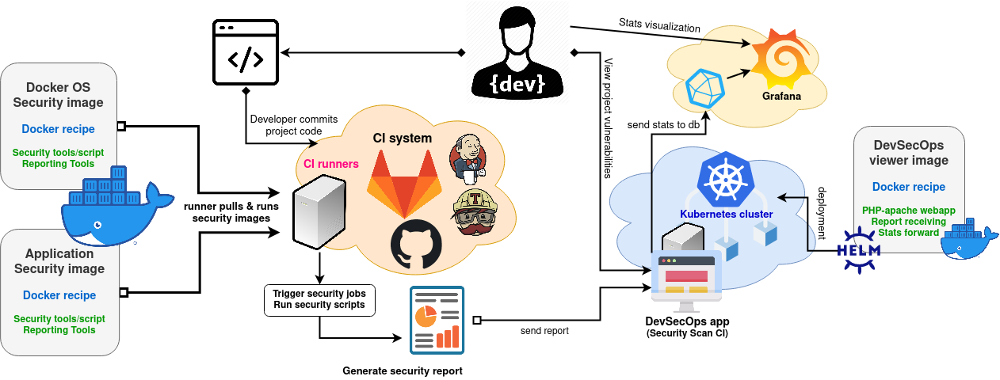
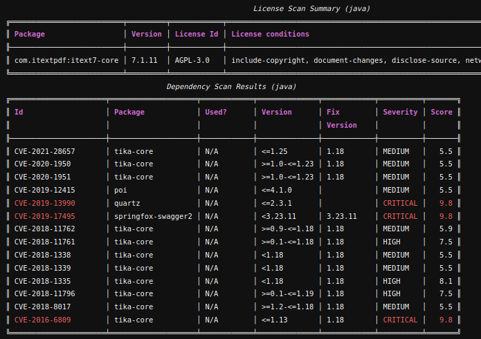
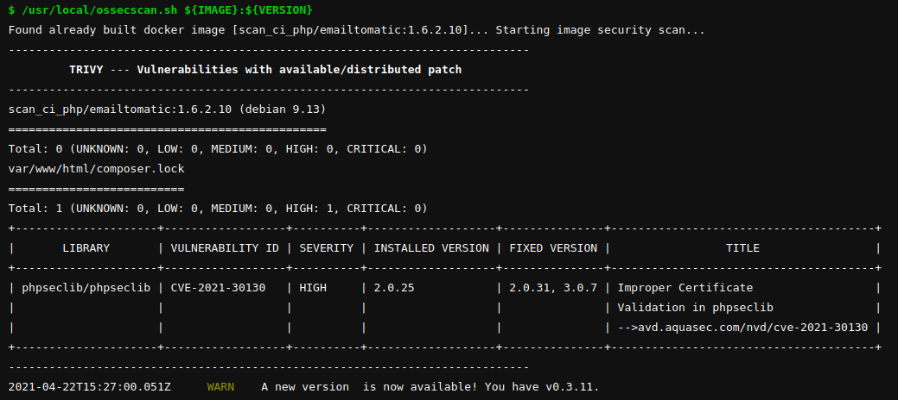
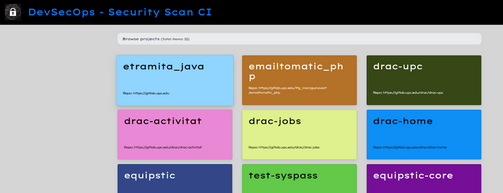
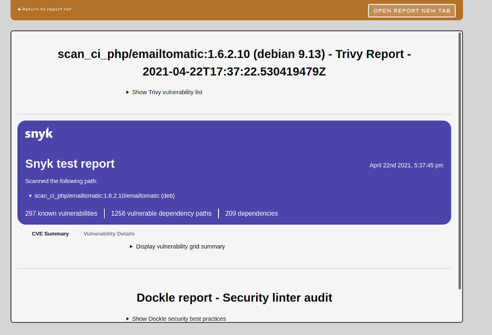
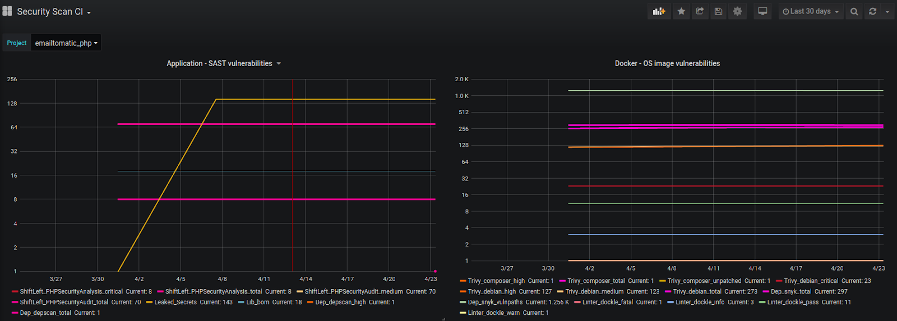

# DevSecOps - Security Scan CI

Securize your application/docker DevOps by applying this solution into your code repositories and start reviewing the vulnerabilities that contains your project before deploying it to production infrastructure.

## How it works

[1 - Integrate security_scan stage to your repository pipeline.](#repository-pipeline-integration)

[2 - Browse and view your project pipeline security/vulnerability reports](#view-security-reports) -- ([devsecops.your_site.es](https://devsecops.your_site.es)).

To create the first report for a Git project just execute the pipeline and check again the visualizaion site!

## Repository Pipeline Integration

There are two main jobs to run along the security_scan stage.

+ APPSecScan => [Application security pipeline](#appsecscan-scanning-an-application)
+ OSSecScan  => [OS *docker* security pipeline](#ossecscan-scanning-a-docker-image)

Pick up and follow the use case guideline which better adapts to your project needs:

1. Repository integration to execute ONLY ONE job in security_scan stage:
    + [Scanning an application](#appsecscan-scanning-an-application)             => follow usage APPSecScan gitlab pipeline
    + [Scanning a docker image](#ossecscan-scanning-a-docker-image)             => follow usage OSSecScan gitlab pipeline

2. Repository integration to execute BOTH jobs in security_scan stage:
   + [Scanning a dockerized application](#scanning-dockerized-application-combining-security-scans)    => both pipeline combination

### APPSecScan - Scanning an application

APPSecScan job is expected to be triggered by the security_scan stage. Thus, the job ideal use case would be triggering it before application gets deployed to preproduction (can be applyied before releasing app to multiple enviroments).
If security job doesn't output any failure, pipeline won't fail and [pre/pro]app_deploy job will be executed (if any).

Just follow this guideline --> Copy and adapt this pipeline to your .gitlab-ci.yml file and start scanning your Applications!
   
    # GitLab stages
    - security_scan # Stage where APPSecScan job is triggered
    - build
    - deploy

    # Gitlab APPSecScan job
    appsecscan:
        image: docker-dev.artifactory.your_site.es/security-scan-ci/appsecscan:latest
        stage: security_scan
        variables:
            SCAN_TYPES: "credscan,depscan,pyhton"       # REQUIRED VARIABLE BY SCRIPT - See supported types
        only:
            - preproduction                             # Same trigger that [pre/pro]app_deploy job
            #- production
            #- master
        tags:
            - YOURsite                                    # Necessary tag to select runner
        script:
            - /usr/local/appsecscan.sh ${SCAN_TYPES}    # Run APP security scan script (SAST)

Mainly, this job executes a script that does all work and will send report to server for visualization.
    
    docker-dev.artifactory.your_site.es/security-scan-ci/appsecscan:latest
        |=> /usr/local/appsecscan.sh $SCAN_TYPES $SCAN_DIR
               $SCAN_TYPES [REQUIRED]: "credscan,depscan,java,javascript,yaml"
                    Supported languages values combination

                    ansible         apex            arm           aws      	
                    bash            bom             credscan      depscan 	
                    go              groovy          java**        jsp      	
                    json 	        kotlin          kubernetes    nodejs**   	
                    php** 	        plsql           python**      ruby**    
                    rust**          serverless      scala         terraform       
                    VisualForce     ApacheVelocity  yaml
                
               $SCAN_DIR [OPTIONAL]: By default $PWD path will be scanned 
                                     (gitlab runner script step $PWD=git project base folder)
                                     Pass a relative path belonging to a project subfolder.
                                     Example: SCAN_DIR="subfolder_from_project/src/"
                
        ** -> selected scan types support Trivy application dependency scaning through these files:
                java     -->    JAR/WAR/EAR files (*.jar, *.war, and *.ear)
                python   -->    Pipfile.lock - poetry.lock
                php      -->    composer.lock
                nodejs   -->    package-lock.json - yarn.lock
                ruby     -->    Gemfile.lock
                rust     -->    Cargo.lock

Available tools on this image:

+ [Shifleft security SAST](https://github.com/ShiftLeftSecurity/sast-scan)
    * Source code static analysis
    * Dependencies scan [depscan] -> appthreat/depscan
    * Credentials/secrets scan [credscan] -> GitLeaks
+ [FOSSA cli](https://github.com/fossas/fossa-cli) => Application dependency/library reports
+ Sonnar-scanner cli => For running quality code *not used*               

### OSSecScan - Scanning a Docker image

OSSecScan job is expected to be triggered by the security_scan stage. Thus, the job ideal use case would be triggering it before release image to (private) docker registry (can be applyied to multiple enviroments - preproduction & production).
If security job doesn't output any failure, [pre/pro]image is going to be pushed on later build stage by the build_preproduction job.

In order to avoid building the same image multiple times you can use the following technique:

    1. Build image
    2. Trigger security scan (execute script)
    3. Save image and export as artifact
    4. Job that pushes [pre/pro]docker image loads image from artifacts.

Follow this guideline in order to integrate OSSecScan job:

Requirements: docker image must be already build when security script is run, or script will exit.

Copy and adapt this pipeline to your .gitlab-ci.yml file and start scanning your Dockers!

    # GitLab stages
    - security_scan # Stage where OSSecScan job is triggered
    - build
    - deploy

    # Gitlab OSSecScan job
    ossecscan:
        image: docker-dev.artifactory.your_site.es/security-scan-ci/ossecscan:latest
        stage: security_scan
        variables:
            IMAGE: $REGISTRY_URL/$PROJECT:$VERSION         # REQUIRED VARIABLE BY SCRIPT 
        only:                                     
            - preproduction                               # Same trigger that [pre/pro]build/push job
            #- production
            #- master
        tags:                                     
            - YOURsite                                      # Necessary tag to select runner
        script:
            # Build/load docker image [$ docker build -t ${IMAGE} ...]
            - /usr/local/ossecscan.sh ${IMAGE}            # Run OS security scan script (see dependencies section)
        cache:
            paths:
                - .trivycache/                            # Cache path for Trivy scanner

Mainly, this job executes a script that does all work and will send report to server for visualization.
    
    docker-dev.artifactory.your_site.es/security-scan-ci/ossecscan:latest
        |=> /usr/local/ossecscan.sh $IMAGE
               $IMAGE: Docker image tag name to be scanned

Integrated OS security tools: 
+ [Trivy](https://github.com/aquasecurity/trivy) => Container scanning
+ [SNYK](https://github.com/snyk/snyk) => Container dependencies
+ [Dockle](https://github.com/goodwithtech/dockle) => Docker security lint benchmark
+ Sonnar-scanner cli => For running quality code (unused)

### Scanning Dockerized Application - Combining security scans

Follow this steps in order to integrate application and OS security scans to your Dockerized application!

1. Create security_scan stage inside the pipeline
2. Add to this stage [APPSecScan](#appsecscan-scanning-an-application) job *SAST scans*
3. Add to this stage [OSSecScan](#ossecscan-scanning-a-docker-image) job *OS security scans*
4. Once you understand both security jobs, you must consider these advices:
   
        APPSecScan job: since it tries to compile/build application, there are no additional considerations for this job.
        
        OSSecScan job: If Docker image needs some application build-in files, these files must be available when image is built. 
                       If you decide to build your image inside this job, you also must compile application before, or serve application built-in files as artifact to this job.

### View security reports and stats
Browse project reports in a PHP build simple web application. 

Check the service at the following url: [https://devsecops.your_site.es](https://devsecops.your_site.es)

Has an authenticated login provided by UPC (SSO-CAS login) restricted to YOURsite/Ithink employers.

Application main features is receiving and displaying reports.

When your runner executes the pipeline, the security script will send the HTML report to this service. 
The url of the recently sent report will be returned to runner console or you can browse this service manually.

Finnally project stats can be seen in Grafana!

### About this repo

1. To push images to artifactory it's required a to push a git tag
+ $git add & git commit
+ $git tag -a X.y -m "vX.y"
+ $git push origin master --follow-tags
2. The pushed images can be set at .gitlab-ci.yml file, you can select:
+ Whether an image should be pushed or not -> <Image>PUSH: "true"|"false"
+ Which version image will it be -> <Image>VERSION: "X.Y"
   
To set which image/s should be pushed to registry edit the following variables inside .gitlab-ci.yml file

    variables:
        OSSECPROJECT: "security-scan-ci/ossecscan"
        OSSECVERSION: "1.0"
        OSSECPUSH: "true"
    
        APPSECPROJECT: "security-scan-ci/appsecscan"
        APPSECVERSION: "1.0"
        APPSECPUSH: "true"

        WEBPROJECT: "security-scan-ci/devsecops"
        WEBVERSION: "1.0"
        WEBPUSH: "false"
